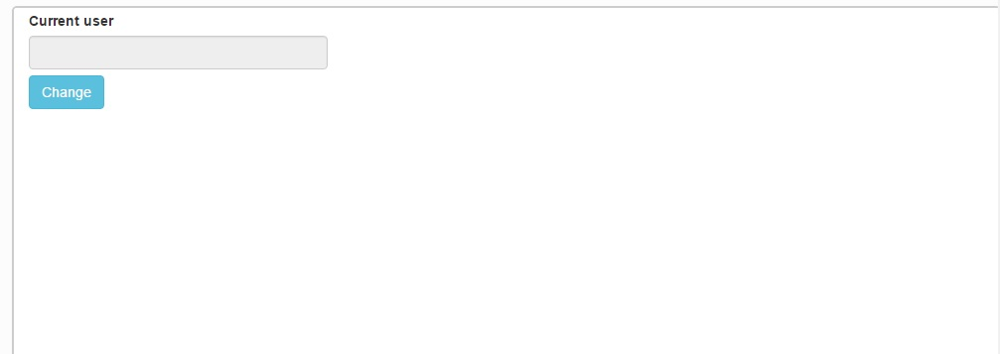
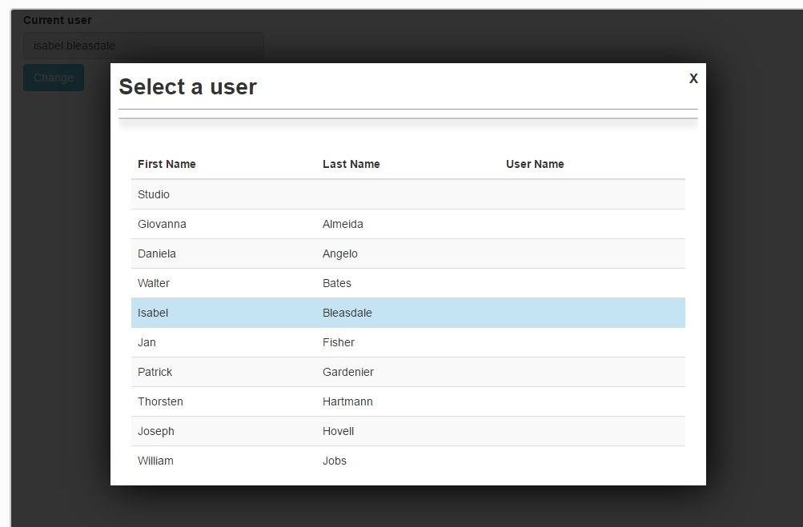
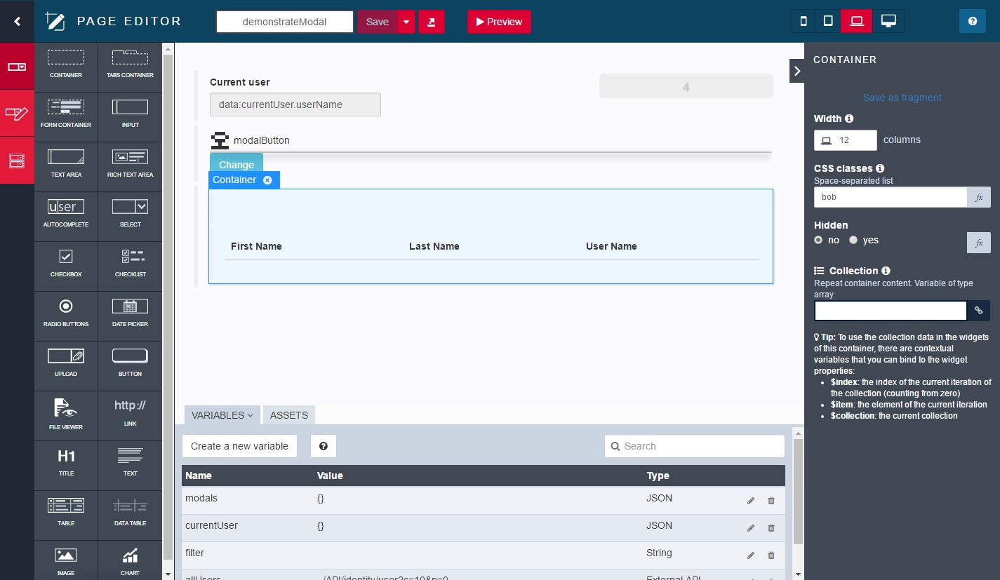

# widget_modal

The Widget Modal button display a button. When you click on the button, then a Modal window appears, and then you can edit something.

A close button is then accessible to ... close the modal window

To create the content of the modal window, create a new Container, and set inside what you like.
Then, give a code in the CSS : in the example, I gave the code "bob"

In the modal button, just reference the code "bob"

At init, the container is then hidden. When you click, the modal is open and then the container is displayed.